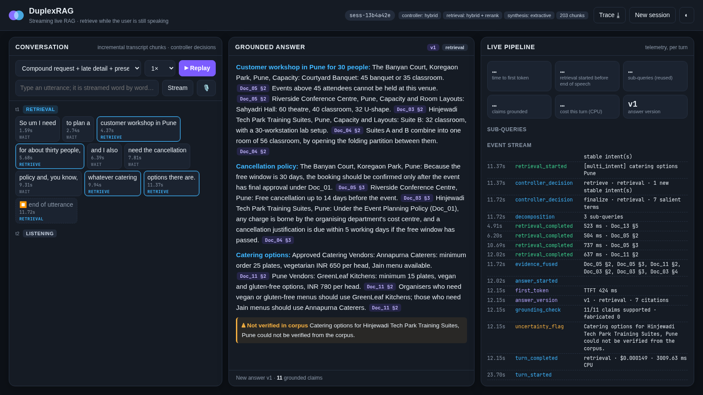

# DuplexRAG - Streaming Live RAG

**Samsung PRISM GenAI Hackathon 2026 · Theme 4 - Streaming Live RAG · Team Pokermons (VITV)**

DuplexRAG answers one natural, spoken request - even one that hides several questions - by
**retrieving while the user is still talking**, splitting the request into the searches it actually
implies, and streaming back a short answer in which **every claim carries a verifiable citation**
(`[Doc_03 §2]`). When the user adds a detail ("actually, it's fifty people"), the answer is
**refined in place - not restarted**; when they only ask to "repeat that in two bullets", nothing is
searched at all. Everything runs on a laptop CPU with two small ONNX models; there is no LLM in the
default path, so an answer turn costs about **$0.00007** of compute.

<p align="center"></p>

| Theme 4 asks for | DuplexRAG |
|---|---|
| Begin retrieving before the utterance ends | Stability-gated **speculative retrieval** per clause; reused at end of speech (entity-aware invalidation) |
| Decide whether retrieval is needed at all | **Turn gate** (rule / model / hybrid): retrieval · refinement · presentation-only · chit-chat |
| Decompose one command into several queries | Clause segmentation, self-repair and spoken-number handling, context carry-over, over-fragmentation guard |
| Fuse and rerank across sub-queries | BM25 + bge-small dense → **RRF** → MiniLM **cross-encoder** → cross-query RRF fusion + dedup |
| Refine rather than restart | **Versioned answer state** (v1 → v2), delta queries only, retained / added / retired claims |
| Strict grounding, explicit uncertainty | Extractive claims, claim-level **grounding verifier**, "could not be verified" flags (never silent) |
| Session-scoped memory only | In-memory session per connection; nothing persisted across sessions |
| Report recall, groundedness, TTFT, cost | JSONL **telemetry** for every chunk/decision/retrieval/version; benchmark harness for gates G1-G6 |

## Quick start

### One command (Docker)
```bash
docker compose up --build
# -> demo UI on http://localhost:8000
# -> the `replay` service streams the held-out benchmark through the engine (DuplexRAG, baseline and
#    7 ablations), writes results/test/summary.md + telemetry traces, and exits 0
```
Models (bge-small-en-v1.5, ms-marco-MiniLM-L-6-v2) and the index are baked into the image at build time,
so the running container needs no network access and no API keys.

### Local (Python 3.11-3.13, [uv](https://docs.astral.sh/uv/))
```bash
uv sync --frozen                         # pinned lockfile
uv run duplexrag serve --port 8000       # real-time web demo (replay / type / speak with Chrome)
uv run duplexrag ask "I need a workshop venue in Pune for thirty people, and the cancellation policy" \
                     "actually it's fifty people"
uv run duplexrag replay data/demo/scenarios.jsonl       # prints turns, writes runs/replay/trace.jsonl
uv run duplexrag bench --split test --ablations          # results/test/summary.md
bash scripts/smoke_test.sh                               # G1: index + replay + schema check + tests
```

### Bring your own corpus
Drop `.md`, `.txt`, `.pdf` or `.jsonl` (`{"doc_id","title","text"}`) files into `data/corpus/` (or set
`DUPLEXRAG_CORPUS_DIR`) and run `duplexrag index`. Sections marked `## §N Title` become citable units
`Doc_ID §N`; other documents are split on headings or ~180-word windows. Nothing in the code refers to the
demo corpus - all vocabulary the controller uses (term salience, proper nouns) is derived from the index.

### Replaying your own streaming sessions
`duplexrag replay FILE.jsonl` accepts one session per line:
```json
{"session_id": "s1", "turns": [
  {"turn_id": "t1", "chunks": [{"t": 0.0, "text": "I need to plan a customer workshop in"},
                               {"t": 0.8, "text": "Pune for 30 people, and I need"},
                               {"t": 1.6, "text": "the cancellation policy and the catering options."}], "end_t": 2.1},
  {"turn_id": "t2", "utterance": "Actually it's going to be fifty people."}]}
```
Turns may give timed `chunks` (ASR partials) or a plain `utterance`, which is streamed at 2.7 words/s in
2-4-word chunks with a 350 ms end-of-speech silence.

## How it works

```
 ASR chunks ──► [1] Retrieval controller ──► [2] Multi-intent decomposer ──► [3] Hybrid retrieval & fusion ──► [4] Session-aware synthesis
 (t=0.0,0.8..)    turn gate: retrieval /        clauses, self-repair,          BM25 + dense → RRF → cross-      versioned answer, delta refine,
                  refinement / presentation /   spoken numbers, context        encoder rerank → cross-query     presentation transforms, extractive
                  chit-chat; stability gate      carry-over, anaphora,          RRF + dedup; sentence rerank     claims + citations, grounding check,
                  (wait / retrieve / suppress)   fragment merging               (runs during speech)             uncertainty flags
                         │                                                                                              │
                         └──────────────────────────────── [5] Telemetry (JSONL, schemas/telemetry.schema.json) ◄───────┘
```

* **Retrieval controller.** Every chunk is classified by the turn gate; only semantically *complete*
  clauses (or an in-progress clause that already has enough salient, non-dangling content) reach the
  retriever, so the engine does not thrash on every token. Follow-up turns wait for 5+ words and new
  terms before speculating, which keeps false triggers on "repeat that" / "thanks" at zero.
* **Speculative retrieval.** Sub-queries are dispatched as soon as they are stable and their results are
  reused at end of speech - unless a late entity or number ("...oh, and it's in Bengaluru") invalidates them.
* **Retrieval.** Okapi BM25 and bge-small (33M) dense search → reciprocal-rank fusion → MiniLM-L6 (22M)
  cross-encoder over fused candidates, with a context-free *hedge* variant for sub-queries whose carried
  context might mislead the reranker; superseded documents are demoted; answer sentences are scored by the
  same cross-encoder inside the retrieval job.
* **Synthesis.** Answers are composed from corpus sentences, so every claim is attributable by construction;
  a claim-level verifier re-checks numbers and wording against the cited chunk (fabricated IDs are
  impossible and counted). Missing evidence produces explicit flags - including *entity x aspect* gaps
  such as "catering for Hinjewadi Tech Park could not be verified". An optional LLM mode rephrases the
  selected evidence through any OpenAI-compatible endpoint and drops every sentence that fails verification.

Details: [docs/ARCHITECTURE.md](docs/ARCHITECTURE.md) (system brief) · [docs/TELEMETRY.md](docs/TELEMETRY.md)
(observability schema) · [docs/BENCHMARK.md](docs/BENCHMARK.md) (evaluation, ablations, failure analysis).

## Results

<!-- RESULTS:START -->
(results are generated by `python scripts/make_report.py` after `duplexrag bench`)
<!-- RESULTS:END -->

## Deliverables (Theme 4 guide, section 8)

| Deliverable | Where |
|---|---|
| Reproducible repository: source, pinned lockfile, config template, one-command run | `pyproject.toml` + `uv.lock`, `.env.example`, `docker-compose.yml`, `Dockerfile`, `scripts/smoke_test.sh` |
| System architecture brief (≤ 6 pages) | [docs/ARCHITECTURE.md](docs/ARCHITECTURE.md) |
| Benchmarking & evaluation report (baseline comparison, ≥ 3 failure analyses, 2+ ablations) | [docs/BENCHMARK.md](docs/BENCHMARK.md), raw outputs in `results/` |
| System demonstration video (≤ 5 min) | `submission/DuplexRAG_demo.mp4` (+ `.srt` captions) |
| Telemetry & observability schema | [docs/TELEMETRY.md](docs/TELEMETRY.md), [schemas/telemetry.schema.json](schemas/telemetry.schema.json) |
| Presentation / AI disclosure | `submission/VITV_Pokermons_Submission.pptx` (+ PDF), `submission/LangAI3.0_AI_Disclosure.docx` |

## Configuration

All settings live in `duplexrag/config.py` and can be overridden with `DUPLEXRAG_<NAME>` environment
variables, e.g. `DUPLEXRAG_CONTROLLER=rule|model|hybrid`, `DUPLEXRAG_RETRIEVAL_MODE=hybrid|dense|bm25`,
`DUPLEXRAG_RERANK=false`, `DUPLEXRAG_THREADS=4`, `DUPLEXRAG_CORPUS_DIR=...`.

Optional LLM phrasing (still grounded and verified):
```bash
export DUPLEXRAG_SYNTHESIS=llm DUPLEXRAG_LLM_BASE_URL=http://localhost:11434/v1 DUPLEXRAG_LLM_MODEL=qwen2.5:3b-instruct
export DUPLEXRAG_LLM_API_KEY=...        # only for hosted endpoints
```

## Repository layout

```
duplexrag/            engine: controller.py, decompose.py, retrieve.py, index.py, synthesize.py, grounding.py,
                      session.py, engine.py, telemetry.py, stream.py, server.py, cli.py, llm.py
duplexrag/bench/      replay benchmark, turn-based baseline, gate metrics
web/                  real-time demo UI (vanilla JS, WebSocket)
data/corpus/          46-document synthetic enterprise knowledge base (see docs/corpus_spec.md)
data/benchmark/       dev.jsonl (tuning), devb.jsonl + devc.jsonl (earlier held-out runs, then diagnosis), test.jsonl (final held-out)
data/demo/            scripted demo sessions
data/controller/      training utterances for the model-based turn gate (domain-general templates)
schemas/              telemetry and output JSON schemas
results/              benchmark outputs (summary.md, metrics, per-turn records, traces)
docs/                 architecture brief, telemetry schema, benchmark report, corpus spec
submission/           presentation, AI disclosure form, demo video
scripts/              smoke test, trace checker, corpus validator, calibration / analysis tools
tests/                unit + end-to-end tests (pytest)
```

## Limitations

* The provided hackathon corpus was not available to us, so all numbers are on a synthetic 46-document
  corpus and four independently written benchmark splits (see docs/BENCHMARK.md for how they were used).
* The default path is extractive: answers are exact corpus sentences, which is maximally grounded but less
  fluent than an LLM; the optional LLM mode trades a little latency and cost for fluency.
* Unanswerable-question detection with small CPU models is conservative: we prefer answering with cited
  evidence over wrongly claiming "not found", so some unanswerable questions receive a related (cited) answer.
* Voice input is simulated from transcripts (allowed by the brief); the web demo can also use the browser's
  streaming speech recogniser in Chrome/Edge.

## Team and disclosure

Team **Pokermons**, VITV. AI assistance was used while building this project; see
`submission/LangAI3.0_AI_Disclosure.docx`.
